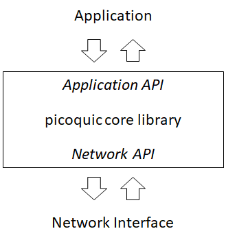

# Architecture of picoquic

Picoquic was first designed with three priorities: conformance to the QUIC specification,
portability, and ease
of testing. As the QUIC specifications progressed from 2017 to 2020, those two priorities served
us well, and ensure that picoquic could be used by other applications doing interoperability
tests, see for example the results of 
[the early interop testing](https://docs.google.com/spreadsheets/d/1D0tW89vOoaScs3IY9RGC0UesWGAwE6xyLk0l4JtvTVg/) and
the current status of the [automated interop runner](https://interop.seemann.io/).
As the standard progressed, once interoperability was achieved, the focus has moved to
performance, while testing continues to guarantee interoperability.

# Picoquic transport library



The main component of picoquic is the core library, which interfaces with applications through
the application API and with the system through the network API.

## Transport library objects

The main objects in the transport library are the QUIC context and the QUIC connections. 
The QUIC context provides the data common to all connections and holds the tables
necessary to route packets to specific connections. Connections are created within
a QUIC context. Each connection context holds path contexts enabling the management
of conenction migration to different addresses, or simulataneous use of multiple
paths if multipath extensions are enabled. The connection context also maintains a list
of streams opened by the application or by the peer, and generally all the structures
required to enable transmission of data according to the QUIC protocol.

## TLS implementation

QUIC uses TLS 1.3 to negotiate encryption keys and verify certificates or public keys
during the handshake. Picoquic uses the TLS implementation provided by
[`picotls`](https://github.com/h2o/picotls), which
in turn uses cryptographic functions provided by openSSL.

## Single threaded library

The QUIC library is not designed to be thread safe. The design assumes that the application
and the network API are coordinated so that only one of the API functions is used at a
time for a given QUIC context, or for any connection within that QUIC context. On the
other hand, it is entirely possible for an application to create several QUIc contexts
and to handle them in parallel.

## Virtual time

The QUIC library does not directly access the time functions provided by the system.
Instead, the calls from the network API are supposed to provide the value of the
current time. This feature is widely used in the test suite, as it enables tests
to run in "virtual time" on top of a network simulator.

## Logging

The QUIC library includes a set of logging functions: text logging, binary logging,
quic logging and performance logging. These functions are optional components. They
will only be linked with the application if the application code enables them.

# Application API

The public API of picoquic is described in the header file `picoquic.h`. Data types and
functions described in this API are meant to be stable. In contrast, internal types and
structures defined in `picoquic_internal.h` may very well change in new releases.
The API enables applications to:

* Create QUIC Contexts
* Create QUIC Connections
* Receive callbacks when new connections are created, or when data or other events
  happen on a connection
* Create data streams and push data
* Close connections

# Networking API

The networking API enables processes to submit incoming packets to a QUIC context,
and to poll a QUIC context for new packets to send. A typical process using
picoquic will be organized around the networking API:

1. Create a QUIC context
2. If running as a client, create the client connection
3. Initialize the network, for example by opening sockets
4. Loop:
  - Check how long the QUIC context can wait until the next action, i.e. get a timer `t`,
    using the polling API
  - Wait until either the timer `t` elapses or packets are ready to process
  - Process all the packets that have arrived and submit them through the
    {{incoming-api}}
  - Poll the QUIC context through the {{prepare-api}} and send packets if they are ready
  - If error happen when sending packets, report issues through the {{error-notify-API}}
5. Exit the loop when the client connections are finished, or on a server if the
   server process needs to close.
6. Close the QUIC context

## Polling API

The polling API allows a process to learn how long the QUIC context can wait until the next
action:
```
int64_t picoquic_get_next_wake_delay(picoquic_quic_t* quic,
    uint64_t current_time,
    int64_t delay_max);

```
There are alternative functions that can be used to obtain information about
specific connections.

## Incoming API

The incoming API allows a process to submit a packet through a QUIC context:
```
int picoquic_incoming_packet(
    picoquic_quic_t* quic,
    uint8_t* bytes,
    size_t length,
    struct sockaddr* addr_from,
    struct sockaddr* addr_to,
    int if_index_to,
    unsigned char received_ecn,
    uint64_t current_time);
```

## Prepare API

The prepare API allows a process to poll the QUIC context and learn whether packets
are ready. The API evolved over time, from a per connection API to a per context API,
and from an API returning a single packet to an API returning multiple packets that
can for example be send in a single call to `sendmsg` using UDP GSO. Developers
should use this latest version:
```
int picoquic_prepare_next_packet_ex(picoquic_quic_t* quic, 
    uint64_t current_time, uint8_t* send_buffer, size_t send_buffer_max, size_t* send_length, 
    struct sockaddr_storage* p_addr_to, struct sockaddr_storage* p_addr_from, int* if_index,
    picoquic_connection_id_t* log_cid, picoquic_cnx_t** p_last_cnx, size_t* send_msg_size);
```
The arguments are:

* quic: pointer to the QUIC context
* current_time: time of the call.
* send_buffer: memory area that will receive the contents of one or several packets.
* send_buffer_max: size of the send buffer.
* send_length: pointer that will receive the amount of data written in the send buffer,
  or zero if no packets are ready to be sent.
* p_addr_to, p_addr_from: pointers that will receive the IP addresses and ports to
  which and from which the packets shall be sent.
* if_index: interface through which the packets shall be sent
* log_cid: optional pointer. If not NULL, will receive the value of a connection identifier that
  could be used to tag log messages relativeto the packets.
* p_last_cnx: optional pointer. If not NULL, will receive a pointer to the connection context
  for which the packets shall be sent, or NULL if the packets are sent outside of a
  connection context, such as for example stateless retry packets.

The call will normally return zero. A non zero value indicates that a processing error
occured.

## Error Notify API

If an error occurs when sending packets, the process should first verify whether the
error code implies that the destination is unreachable. It may for example use
this error classification API, whih returns a non zero value when the error
indicates unreachability:
```
int picoquic_socket_error_implies_unreachable(int sock_err)
```
When that is the case, the process calls the notification API:
```
void picoquic_notify_destination_unreachable(picoquic_cnx_t* cnx,
     uint64_t current_time, struct sockaddr* addr_peer, struct sockaddr* addr_local, int if_index, int socket_err);
```
This will cause picoquic to either switch to an alternate path if one is available, or terminate
the connection otherwise.