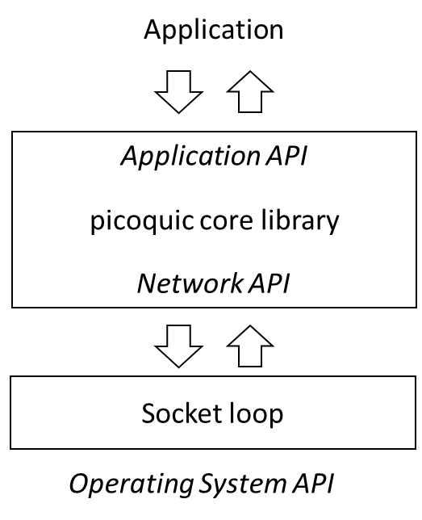

# Default Socket Loop

The architecture document {{architecture.md}} describes how the picoquic exposes
both an application API, on top of which applications implement their logic, and
a networking API, under which implementations provide code to send or receive
messages. The library provides a default implementation of the networking services,
which is suitable for simple applications.



The socket loop code is suitable for applications that manage a single
UDP socket. It can be operated in synchronous mode for single threaded
applications, or in asynchronous mode for multithreaded applications.

## Launching the socket loop

The socket loop API are defined in `picoquic_packet_loop.h`. Applications
that want to use this component will need to include that header file
and launch the loop by calling the function `picoquic_packet_loop_v2`
for synchronous operation, or `picoquic_start_network_thread` for
multithreaded operation.

If an application provide its own implementation of the packet loop, it should
call its own functions instead of the packet loop, and it should not
include the header file `picoquic_packet_loop.h`. In that case, the code of the
packet loop will not be linked in the application's binary.

## Synchronous operation

In synchronous operation, the application prepares a QUIC context and an application
context and then calls `picoquic_packet_loop_v2`:

```
int picoquic_packet_loop_v2(picoquic_quic_t* quic,
    picoquic_packet_loop_param_t * param,
    picoquic_packet_loop_cb_fn loop_callback,
    void * loop_callback_ctx);
```

The loop will execute,
calling the Picoquic Networking API functions `picoquic_prepare_next_packet_ex`
to ask the stack whether packets are ready to be sent and
`picoquic_incoming_packet_ex` when packets are received from the network.

The code expects that the `quic` context has already been created by the
application, setting transport parameters and other options as seen fit by the
application.

The `param` argument contains data to parameterize the packet loop:

* `local_port`: the value of the local port to which the socket will be
  bound, in host order (e.g., if chosing port 443, the value 443). If
  that value is set to zero, the socket will be open on a random port,
  as chosen by the system.

* `local_af`: the value of the Address Family that should be selected for
  the local socket. If the value is left to `AF_UNSPEC`, two sockets
  will be created, one for `AF_INET` (IPv4), and one for `AF_INET6` (IPv6).

* `dest_if`: the interface identifier that should be associated with the local
  socket, or 0.

* `socket_buffer_size`: if specified, the size of the socket send and
  receive buffers, set with the socket option SO_SNDBUF and SO_RCVBUF.

* `do_not_use_gso`: by default, the socket loop tries to send several
  UDP packets in a single call to `sendmsg`, in order to improve
  performance. Setting this flag forces the code to send exactly
  one message per call.

* `extra_socket_required`: request to create a secondary socket, used
  for example to test or simulate migration or multipath functions.
  That socket will be set to a random port number, chosen by the
  systems. If the parameter `local_af` is left to `AF_UNSPEC`, two sockets
  will be created, one for `AF_INET` (IPv4), and one for `AF_INET6` (IPv6).

* `prefer_extra_socket`: if the source address and source port are set,
  outgoing packets will be sent on a socket with matching bindings.

* `simulate_eio`: simulate an EIO socket error. This error happens when
  the socket does not support UDP GSO. The simulation enables us to
  test the automatic fallback to one packet per sendmsg call.

* `send_length_max`: the largest buffer size used by the calls to
  `picoquic_prepare_next_packet_ex`. This is used in debugging,
  to verify that the `UDP_GSO` implementation is functional.


In addition, the packet loop exposes a network level callback API, to handle
network level events that are not directly linked to the QUIC connections.
The callback API is defined by the function prototype:

```
typedef int (*picoquic_packet_loop_cb_fn)(picoquic_quic_t * quic, picoquic_packet_loop_cb_enum cb_mode, void * callback_ctx, void * callback_argv);
```

It exposes a series of callback events:

* `picoquic_packet_loop_ready`: Indicates that the required sockets are properly open. Passes an argument of type
  `picoquic_packet_loop_options_t`, enabling the application to set the corresponding flags if
  it wants to be called for a time check before the loops waits for timers or incoming packets.
* `picoquic_packet_loop_after_receive`: Called after packets have been received, enabling the application
  to perform picoquic API calls triggered by the received data.
* `picoquic_packet_loop_after_send`: Called after packets have been sent, enabling the application
  to perform picoquic API calls triggered by the sent data.
* `picoquic_packet_loop_port_update`: Provides a "loopback" socket address corresponding to the main
  socket. Can be used to learn the port number associated with that socket.
* `picoquic_packet_loop_time_check`: Called before the packet loop starts waiting for a new packet or a
  timer. The calling argument of type `packet_loop_time_check_arg_t` provides the current time and
  the expected value of the timer. The application may set a lower timer value.
* `picoquic_packet_loop_system_call_duration`: If the application has opted to monitor system call duration,
  the packet loop will compute and update statistics on the duration of calls, and passes them in
  an argument of type ``packet_loop_system_call_duration_t`. This could be use during performance
  tuning, to check whether system load slows down the packet loop.
* `picoquic_packet_loop_wake_up`: called when the packet loop has been awakened by a call to
  `picoquic_wake_up_network_thread`, enabling the application to perform picoquic API calls.
  (Only useful in asynchronous mode.)
* `picoquic_packet_loop_alt_port`: Provide the port number associated with the alternate socket.
  This is used for simulations and tests of the migration and multipath capabilities,
  creating alternate paths for alternate port number.

If the processing of the callback is successful, the return code should be set to 0.
If the application wants to terminate the packet loop, it can set the
return value to `PICOQUIC_NO_ERROR_TERMINATE_PACKET_LOOP`. A couple of
other error codes, `PICOQUIC_NO_ERROR_SIMULATE_NAT` and
`PICOQUIC_NO_ERROR_SIMULATE_MIGRATION` are used to manage
simulations of migration and multipath -- but could be removed in
future versions. Other returned values will cause the packet loop to terminate,
returning the error value to the application.

## Single process constraints

When running in synchronous mode, the packet loop reacts only to timers and arrival of
packets. This is generally adequate for a small server that simply serves data files,
such as the basic HTTP server used in `picoquicdemo` or the simple P2P server presented
in the `sample` code. Such servers will receive a command from the networked peer,
prepare a response and schedule the required packets, all in a single process.

The synchronous mode can support limited clients that are launched once and execute
a programmed scenario. For example, the `picoquicdemo` take as a parameter a list
of scenario that specifies a series of requests to post or download pages. The `sample`
client takes as parameter a list of files to acquire from the peer. For supporting these
scenarios, the client code will initiate a connection in the selected `quic`
context before starting the packet loop. When the packet loop starts, the initial
packets for that connection will be sent on the socket, and the connection will
continue until the end of the programmed scenario.

The synchronous mode will not easily support interactive scenarios, in which
requests are sent after UI interactions. It will also not easily support multimedia
scenarios, such as for example a video conference. The application will want to
use multiple threads, typically one for media capture, one for rendering, another for
managing the UI, and of course an independent thread for managing the QUIC
connections. For that, the application needs to start the packet loop
in asynchronous mode.

## Asynchronous operation

Applications that operate in asynchronous mode will want start the packet loop
using the `picoquic_start_network_thread` API:

```
picoquic_network_thread_ctx_t* picoquic_start_network_thread(
    picoquic_quic_t* quic,
    picoquic_packet_loop_param_t* param,
    picoquic_packet_loop_cb_fn loop_callback,
    void* loop_callback_ctx,
    int * ret);
```

The parameters are the same as the call to `picoquic_packet_loop_v2`, with two differences:
the call returns a thread context of type `picoquic_network_thread_ctx_t` describing
the thread that was just created, and upon exit of the packet loop the variable
`ret` will contain the exit code of the loop -- the same value that would be
returned by a synchronous loop.

The API `picoquic_start_network_thread` is designed to be simple. It uses the default
thread handling corresponding to the OS, such as `pthread` on Unix variants and
`CreateThread` on Windows. Developers can substitute their own thread management functions
by calling:
```
picoquic_network_thread_ctx_t* picoquic_start_custom_network_thread(
    picoquic_quic_t* quic,
    picoquic_packet_loop_param_t* param,
    picoquic_custom_thread_create_fn thread_create_fn,
    picoquic_custom_thread_delete_fn thread_delete_fn,
    picoquic_custom_thread_setname_fn thread_setname_fn, 
    char const* thread_name,
    picoquic_packet_loop_cb_fn loop_callback,
    void* loop_callback_ctx,
    int * ret);
```
This call lets application supply their own functions for creating and deleting threads, and
also for naming threads.

## Picoquic APIs are not thread safe

When operating in asynchronous mode, developers should constantly remember that
the Picoquic APIs are not designed to be thread safe. For example, if two
threads were to call `picoquic_create_cnx` in parallel, it is entirely
possible that the internal state of the `quic` context will become
incoherent. The recommended solution is to implement some kind of synchronization
between the application thread and the background thread running Picoquic.

A typical operation would be:

* the application prepares a new message, to be sent for example on
  a QUIC stream in a specified connection,

* once the message is ready, the application calls `picoquic_wake_up_network_thread`

* in the next `picoquic_packet_loop_wake_up` callback, the application
  calls the necessary Picoquic API.

This structure ensures that the Picoquic API is called from within the
networking thread, and that the `quic` context will remain coherent.

## Don't seat on a callback

Callback APIs like used by Picoquic are simple to understand, but they have
one well known drawback: a badly designed application could start a
lengthy operation within a callback, during which time the entire
networking thread would become unresponsive. Don't do that! It is OK
to copy data from memory, call picoquic APIs, maybe read or write
a packet worth of data to a local storage, but doing much more
than that is asking for trouble.

One specific form of trouble is waiting too long for semaphores or other locks
from within a callback. Some kind of locking may be needed to synchronize
multiple threads, as in the message passing described in the previous
section, but it should be carefully designed so that critical sections
remain very short and contentions are resolved quickly.

Remember that network timers are generally
proportional to the network latency, which can be a few milliseconds on
a local network or a few tens of milliseconds in a typical Internet
connection. Waiting even a fraction of that in a callback can delay
the processing of packets, cause spurious packet losses, and generally
affect the performance of the connection.
